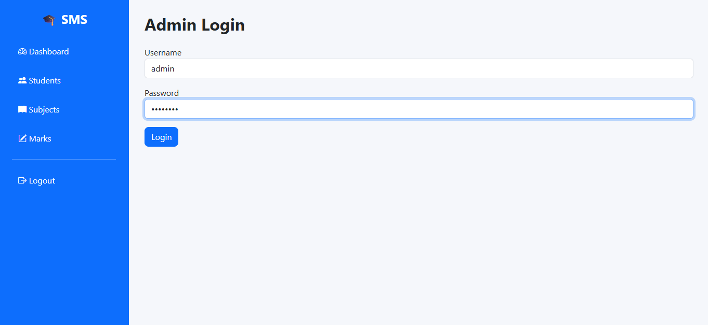

# 🎓 Student Management System

A full-stack **Student Management System** built with **Flask**, **MySQL**, **SQLAlchemy**, and **Bootstrap 5**. The application provides secure authentication, student/subject/marks management, interactive analytics dashboards, PDF report generation, search, pagination, and data export capabilities.

---

## 📌 Features

### 🔐 Authentication

- Secure Admin Login
- Password Hashing
- Session Management using Flask-Login
- Protected Routes
- Logout Functionality

---

### 👨‍🎓 Student Management

- Add Student
- Edit Student
- Delete Student
- View Student List
- Duplicate Roll Number Validation
- Search Students
- Pagination
- Student Report Generation

---

### 📚 Subject Management

- Add Subject
- Edit Subject
- Delete Subject
- Search Subjects
- Pagination

---

### 📝 Marks Management

- Assign Marks
- Edit Marks
- Delete Marks
- Search Marks
- Pagination

---

### 📊 Dashboard Analytics

Interactive dashboard displaying:

- Total Students
- Total Subjects
- Total Marks Entries
- Average Marks
- Top Performing Students
- Subject Performance
- Grade Distribution
- Recent Marks
- Recently Added Students

---

### 📈 Data Visualization

Built using **Chart.js**

- Grade Distribution Pie Chart
- Subject Performance Bar Chart

---

### 📄 Reports

- Individual Student Report Card
- PDF Report Generation

---

### 📤 Export

- Export Students to Excel
- Export Students to CSV

---

### 🎨 User Interface

- Responsive Bootstrap 5 Layout
- Sidebar Navigation
- Dashboard Cards
- Interactive Charts
- Professional Tables
- Quick Action Buttons

---

## 🛠 Tech Stack

### Backend

- Python
- Flask
- SQLAlchemy
- Flask-Migrate
- Flask-Login

### Frontend

- HTML5
- CSS3
- Bootstrap 5
- Bootstrap Icons
- Chart.js
- JavaScript

### Database

- MySQL

### Libraries

- WTForms
- Flask-WTF
- ReportLab
- OpenPyXL
- PyMySQL

---

# 📂 Project Structure

```
Student_Management_System
│
├── database/
│
├── forms/
│
├── migrations/
│
├── models/
│
├── routes/
│
├── services/
│
├── static/
│   ├── css/
│   ├── js/
│   └── uploads/
│
├── templates/
│   ├── dashboard/
│   ├── student/
│   ├── subject/
│   ├── marks/
│   ├── report/
│   └── auth/
│
├── tests/
│
├── utils/
│
├── app.py
├── config.py
├── requirements.txt
└── README.md
```

---

# 🗄 Database Schema

```
User
│
├── id
├── username
├── password
└── role

Student
│
├── id
├── roll_no
├── first_name
├── last_name
├── gender
├── email
├── phone
├── class_name
├── division
└── admission_date

Subject
│
├── id
├── subject_code
└── subject_name

Marks
│
├── id
├── student_id
├── subject_id
└── marks
```

---

# 🚀 Installation

## Clone Repository

```bash
git clone https://github.com/YOUR_USERNAME/Student_Management_System.git
```

```bash
cd Student_Management_System
```

---

## Create Virtual Environment

Windows

```bash
python -m venv .venv
```

Activate

```bash
.venv\Scripts\activate
```

---

## Install Requirements

```bash
pip install -r requirements.txt
```

---

## Configure Environment Variables

Create a **.env** file.

```env
SECRET_KEY=your_secret_key

DB_USER=root
DB_PASSWORD=your_password
DB_HOST=localhost
DB_PORT=3306
DB_NAME=student_management
```

---

## Run Database Migration

```bash
flask db upgrade
```

---

## Run Application

```bash
python app.py
```

Application runs on

```
http://127.0.0.1:5000
```

---

# 📷 Screenshots

## Login



---

## Dashboard


---

## Student Management


---

## Subject Management


---

## Marks Management


---

## Student Report


---

# 📌 Future Enhancements

- Student Photo Upload
- Role-Based Access Control (Admin/Teacher)
- Email Notifications
- Attendance Management
- Result Analysis Dashboard
- Student Profile Page
- Dark Mode
- REST API Integration
- Docker Deployment
- Cloud Storage for Student Documents

---

# 📚 Learning Outcomes

This project helped strengthen practical knowledge of:

- Flask Application Factory Pattern
- Blueprint Architecture
- SQLAlchemy ORM
- MySQL Database Design
- Authentication using Flask-Login
- Service Layer Architecture
- WTForms Validation
- Chart.js Integration
- PDF Generation
- Excel & CSV Export
- CRUD Operations
- Search & Pagination
- Dashboard Analytics
- Git & GitHub Workflow

---

# 👨‍💻 Author

**Shubham Mane**

GitHub: https://github.com/ShubhamMane1211

LinkedIn: https://linkedin.com/in/shubhammane1211

Email: shubhammane586@gmail.com

---

# ⭐ Support

If you found this project useful, consider giving it a ⭐ on GitHub.
